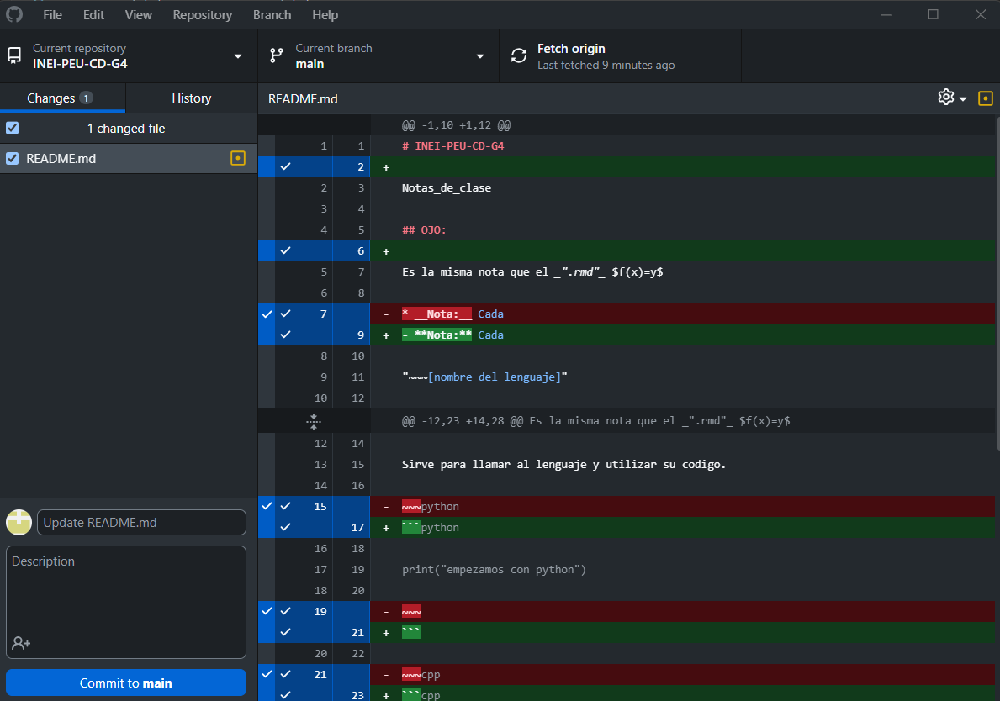

# INEI-PEU-CD-G4

Notas_de_clase

## OJO:

Es la misma nota que el _".rmd"_ $f(x)=y$

- **Nota:** Cada

"~~~[nombre del lenguaje]"

"~~~"

Sirve para llamar al lenguaje y utilizar su codigo.

```python

print("empezamos con python")

```

```cpp

#include <iostream>

#include <string>

```

```r

x <- 56

```

---

Operando con desktop

"Ctrl+S" #para guardar localmente



La original esta sin el check y los cambios con el check
